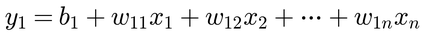
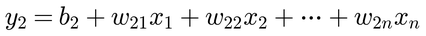
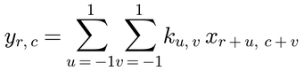
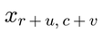
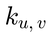
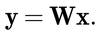
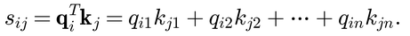
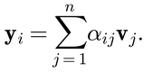
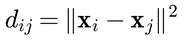
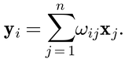

If you read the headlines today, you might think artificial intelligence operates on some incomprehensible, even magical, plane. 
Terms like *transformer*, *attention mechanism*, and *deep neural network* sound like they were beamed in from a research lab you're not cleared to enter. 
But if we lift the hood on these massive models, the mysticism quickly evaporates. 

<!--more-->

> Note: I used AI assistants to help format the equations, create diagrams, and refine the prose in this article. The concepts, ideas, and opinions are my own.

In [my previous post](/2024-05-28/how-neural-nets-work.html), I described a neural network as a huge pile of simple weighted sums. This post follows the trail a little further. Two of the most famous neural-network components have close relatives in old-fashioned signal processing. The ideas are recognizable once we look at the basic calculations. 

This does not make modern AI trivial. Getting these systems to work well still takes an incredible amount of data, computation, and engineering. But it hopefully does take the wizard cloak off. 

## The basic operation: a weighted sum

At the smallest scale, a neural network keeps doing variations of this:

Each input *x*ᵢ gets multiplied by a weight, the products are added, and an offset *b* is thrown in. The two outputs above see the same inputs, but use different weights and offsets. Often, the above weighted summation is followed by a simple nonlinear operation, e.g. setting outputs *y*ᵢ with negative value to 0. Of course, in meaningful networks, there will be a _very_ large number of inputs, outputs, and stacks of calculations like these. 

Training is the long, automated process of nudging those weights until the outputs become useful for a task.

## Convolutional layers are learned image filters

You might be familiar with image processing filters such as "blur" and "sharpen", in software like Photoshop. These filters often use this same operation in a specific form: lay a little grid of numbers (a *kernel*) over a patch of the image, multiply each kernel number by the pixel underneath it, and add everything up into one output value.

Here 

is a pixel near position (*r*,*c*), and 

is the kernel value that lines up with it. Slide this little calculator across every position in the image and you get a whole new image — blurrier, sharper, or with edges highlighted, depending entirely on the nine numbers you picked for *k*. Kernel values correspond to weight values *w* in the above. 

The same kernel values get reused at every position in the image. That reuse is enabled by the principle of *invariance*: — a vertical edge should count as a vertical edge whether it shows up top-left or bottom-right in the image. 

So-called *convolutional* layers in neural networks for image recognition tasks are direct extensions of the basic operations above. A full network is a stack of such layers. 

The thing that changes in machine learning is *who picks the kernel numbers (weights)*. Conventionally, filter kernels were *designed* by engineers. In deep neural nets, the weights are determined by *training*, by nudging the numbers until the whole network gets better at its job, given a *data set*. 

So a convolutional neural net is not a digital replica of a brain. It is a stack of learned signal filters, mixed with nonlinear operations, where later filters get to build on what earlier filters found.

## A shorthand worth learning

Before we get to attention, one notational trick makes the equations far less exhausting to write. We can write a series of linear equations (like our series of weighted sums above), with any given number of inputs and outputs, like so: 

Where **x** is a column (a.k.a. *vector*) of multiple input values, **W** is a grid (a.k.a. *matrix*) of learned weights, and **y** contains multiple output values. A grid with dimensions higher than two is called a *tensor*. Ok, you can forget the last note right away, but just remember that an equation with bold letters means something similar to our first couple of equations above.

## Add a dimension

Now consider we have multiple data vectors, e.g. **x**ᵢ, **x**ⱼ, and a whole bunch more. 
In a language model, **x**'s are word tokens, and *i* and *j* index words in a sentence. In image recognition, **x**'s are image pixel patches, *i* and *j* index patch locations in an image. We can call all these *vectors*, *tokens*, or *items*. The model has no opinion on the subject matter; it just sees numbers. 

Notice that subscripts *i* and *j* now refer to entire vectors, not single numbers. I just lifted us into another dimension. 

## Attention layers: the twist is in the weights

A convolution kernel is fixed once training ends and stays fixed while running the model. Attention actually keeps the same weighted-sum core, but adds one twist — some weights are computed on the fly, freshly, from the input itself, every single time. This provides a lot more flexibility in finding data points that might be relevant to a particular pixel (image recognition) or word (language models) being processed. 

How so? Enter *query*, *key*, and *value*. 

### Query, key, and value vectors

For each input vector **x**ᵢ, an attention layer creates three representations:

The names *query*, *key*, and *value* are useful labels, but do not let them smuggle too much meaning into the calculation. They are three differently transformed lists of numbers:

- **q**ᵢ: what this item will use to go compare itself with others,
- **k**ⱼ: what other items offer up to be compared against,
- **v**ⱼ: the actual content that gets mixed into the output, once we know how much to trust item *j*.

### From similarity to weights

To update item *i*, an attention layer compares its query with the key of every candidate item *j*:

A bigger outcome means the these two vectors are more aligned (more similar to each other), and an outcome closer to 0 means that these two vectors are not aligned. That's all a dot product ever is here: a similarity score, nothing more mystical. 

Those raw scores get scaled down and pushed through an operation called softmax, which turns them into positive numbers that add up to one:

For intuition, the important bit is this: the resulting weights αᵢⱼ are positive and add up to one across *j*. Think of them as a budget: giving more weight to one item leaves less for the others. The division by *D* is used to keep the scores from getting unwieldy as vectors grow. 

Finally, take a weighted average of the value vectors:

In plain language: for each item, compare it with the others, give better matches a larger share of the budget, and blend their value representations. The diagram below shows a simple example.

Saying that a token “looks for what matters” or that the model "attends to each word" is anthropomorphic shorthand. The literal story is less dramatic but more accurate: once again it is a weighted average calculation. But enabling the weights to be computed on the fly, from the input itself (or outputs of previous stages), provides a lot more flexibility. 

## Non-Local Means: a familiar version of the same pattern

The broad pattern behind attention did not begin with transformers. A particularly nice older example is the Non-Local Means (NLM) image-denoising filter, introduced in 2005.

The problem NLM solves: an ordinary noise filter averages nearby pixels to smooth out noise, but it also smears real edges and textures along with it. NLM's fix is to widen the search — instead of only trusting *nearby* pixels, compare the patch around pixel *i* to patches everywhere else in the image, and trust the ones that actually look similar, wherever they happen to sit.

That's the squared distance between two patches. Small distance means "these look alike." NLM turns distance into a normalized weight the same way attention turns similarity into α:

We just have a minus sign because this uses distances instead of inner products and larger distances mean higher *dissimilarity*. 
The knob *H* decides how forgiving the comparison is — small *H* only trusts near-identical patches, larger *H* spreads trust more generously. 

The denoised output is then another weighted average:

That is remarkably close to the attention recipe: compare items, normalize the comparison scores, and compute a weighted combination. The diagram below illustrates this. 

## Local versus global

In addition to the structure of the calculation, NLM and attention share another key property: both operate in a *non-local* manner. NLM may use similar image patches far away from each in an image to use in the average for improved denoising. An attention layer may do the same: use pixel patch embeddings from all over an image (Vision Transformers); or words (tokens) from a very large context of text to interpret what's going on and generate the next word (LLMs). This in itself explains a significant part of the quality improvement obtained with transformers and NLM, relative to what came before. 

Btw, this "global" manner of the calculation also hugely increases computational cost. A huge amount of AI research has been going on to battle this computational cost, without affecting the quality of the output, since transformers were introduced in their canonical form in 2017. 

We can put several methods under one comfy mathematical umbrella, called a generalized non-local operation:

The function *f* supplies a similarity score, *g* supplies the representation to combine, and *C*(*x*) normalizes the result. In NLM, *f* is based on patch distance and *g* is essentially the original signal. In attention, *f* comes from the similarity of learned query and key projections, while *g* is a learned value projection. Same broad recipe; different ingredients.

This framing is from the 2018 paper *Non-local Neural Networks* and makes the connection explicit. I love papers that clarify connections and break things down elegantly. Deep learning papers often introduce techniques that resemble established signal-processing methods, without reference, instead using a new name as if it came out of nowhere. OK, I admit this is definitely a pet peeve of mine :-). 

## Cross-Attention and the Guided Filter

So far, we discussed *self-attention*, where queries, keys, and values all derive from the same input text or image. The *cross-attention* variant allows the query and key values to derive from different sources. For example, when translating an English text into Dutch, key and value vectors may come from the original English text, while query vectors derive from the Dutch text being generated. 

Cross-attention resembles a technique called *guided image filtering* introduced around 2010 in the field of computer vision. In a guided image filter, we have an input image **X** (to be filtered) and a guidance image **G**. The output pixel *y*ᵢ is computed as a weighted average of pixels in **X**, but the spatial/affinity weights are calculated based on the structures, edges, or features found in the guidance image **G**. This can also be seen as cross-modal adaptive filtering. Guided image filtering in itself was a generalized form of the more familiar *bilateral filter* which was introduced in 2005 by Tomasi and Manduchi.

I used a similar idea in my own work on video processing prior to 2010, illustrated in the figure below. The image on the left is a frame of video with camera motion, while the Japanese characters overlaid are motion-less. The task at hand was to estimate the motion of the scene "behind" the characters. The image on the right shows a visualization where the direction of motion is coded as a hue and magnitude of motion is coded as saturation. 

The motion field should generally be smooth as it results from camera motion; however the Japanese characters are not moving, hence there should be a sharp change around the boundaries of the characters. I was able to achieve this by adaptively filtering the motion field (on the right), and guiding the filter weights by the image information itself (on the left) which already contains sharp edges around the characters and hence contains the desired structure across the image grid. 

In both guided filtering and cross-attention, the mechanism allows the model to ask: "Where should information move based on the structure of Domain A, and what information should be moved from Domain B?"

## The relationship—and the important differences

The shared structure is real, but the differences do real work. In Non-Local Means, we compare raw image patches (pixel values) directly. While in the neural net Attention layer, we compare learned query/key projections. In Non-Local Means, the values being averaged are the original pixel values, which is natural since the method was intended for noise reduction. In contrast, the Attention layer uses learned projections, opening up a huge amount of generality and capability. 

NLM starts with a human-designed idea of what patch similarity means. Attention lets a neural network learn what similarity should mean for a particular task. In text, that may involve grammar, repeated names, or another feature that helps prediction. In images, it might involve shapes, textures, or object parts. The model is not handed a definition of relevance; it figures out useful representations during training.

These generalizations enabled the Transformer to be applied with tremendous success in many domains and tasks. 

## The real source of the breakthrough

There is no single magical layer hiding inside an AI model. Convolution is learned filtering. Attention is learned similarity-weighted aggregation. Both are ordinary arithmetic, repeated on an industrial scale.

What is new is the particular arrangement and even more so, the scale of the compute and data: many layers, billions of learned parameters, huge training data sets (entire Internet), powerful hardware, and optimization methods that tune the whole system together. That is not a small footnote. It is why these familiar ingredients can produce surprisingly capable models.

Knowing the mechanism does not mean every learned feature or every particular output is interpretable. Large models are still complicated systems, and their internal strategies at higher levels remain hard to inspect. But *complicated* is not the same as *incomprehensible*. Their building blocks are recognizable engineering tools. That is a much better place to start than magic.

## References

1. A. Buades, B. Coll, and J.-M. Morel, “[A Review of Image Denoising Algorithms, with a New One](https://doi.org/10.1137/040616024),” *SIAM Journal on Multiscale Modeling and Simulation*, 2005.
2. K. He, J. Sun, and X. Tang, “[Guided Image Filtering](https://doi.org/10.1007/978-3-642-15549-9_1),” *ECCV*, 2010.
3. A. Vaswani et al., “[Attention Is All You Need](https://arxiv.org/abs/1706.03762),” 2017.
4. X. Wang et al., “[Non-local Neural Networks](https://arxiv.org/abs/1711.07971),” 2018.
5. Peter van Beek, “[We do know how AI models work](/2024-05-28/how-neural-nets-work.html),” 2024.
